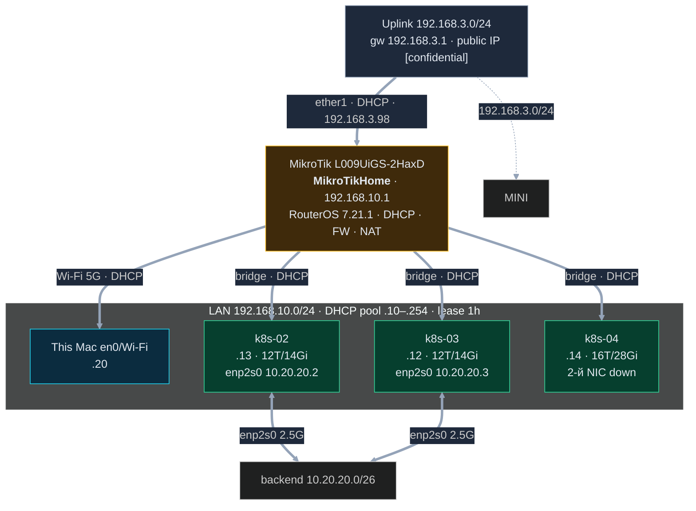

# Карта сети — demo-ai-lab

Актуализировано **2026-02-12 04:38 MSK** по живому аудиту: REST-API MikroTik (`192.168.10.1`),
DHCP-leases с роутера, SSH на ноды. **2026-09-24** MAC/логины — в `inventory.local.md`
(не публикуется).

## Сегменты

| Сегмент | Назначение | Адресация | Статус |
|---|---|---|---|
| `192.168.10.0/24` | LAN: кластер + консоль, DHCP, NAT в интернет | DHCP pool `.10–.254` (lease 1h10m) | живой |
| `192.168.3.0/24` | uplink за MikroTik (gw `.1`, dns `.1`); DHCP на ether1 (MikroTik = `.98`) | живой |
| `10.20.20.0/26` | backend p2p k8s-02↔k8s-03, 2.5G MTU 1500 | статика в netplan | живой, L2 проверен |

## Узлы кластера

| Хост | IP (LAN, DHCP) | 2-й интерфейс | CPU | RAM | Роль / состояние |
|---|---|---|---|---|---|
| `k8s-02` | 192.168.10.13 | `enp2s0` 10.20.20.2/26 · 2.5G up | 12T (6C, R5 7640HS) | 14Gi | будущий CP · Ubuntu 24.04.4 |
| `k8s-03` | 192.168.10.12 | `enp2s0` 10.20.20.3/26 · 2.5G up | 12T (6C, R5 7640HS) | 14Gi | worker · Ubuntu 24.04.4 |
| `k8s-04` | 192.168.10.14 | `enp3s0` — **down** | 16T (8C, R7 H 255) | 28Gi | новый, БЕЗ containerd · Ubuntu 24.04.4 |
| `This Mac` | 192.168.10.20 (Wi-Fi) | — | — | — | консоль (ssh/kubectl) |

## Ключевые точки

- Шлюз — физический MikroTik `L009UiGS-2HaxD` (`192.168.10.1`, identity `MikroTikHome`),
  RouterOS 7.21.1. WAN = `192.168.3.98/24` за шлюзом `192.168.3.1`; public IP [confidential].

## Проверено / не проверено

**Проверено (живые команды):**
- SSH по ключу на `k8s-02/03/04` → `hostname` соответствует, backend-интерфейсы те же.
- Аутентификация на MikroTik: REST API (Basic) подтверждён, SSH на роутере отклонён.
- DHCP: pool `.10–.254`, lease 1h10m; DNS-статик `router.lan`.

**Не проверено (не выдумываю):**
- НЕ резервируются ли DHCP-лизы нод по MAC (иначе адреса поедут со следующим lease).
- Внешняя доступность демо-сервисов из интернета (public IP [confidential] — проверял только в облаке роутера).

## Управление

Подключение к нодам (SSH) и к MikroTik (Winbox/REST) — см. `inventory.local.md` (доступ
только у владельца; логины/пароль там, файл не публикуется).
