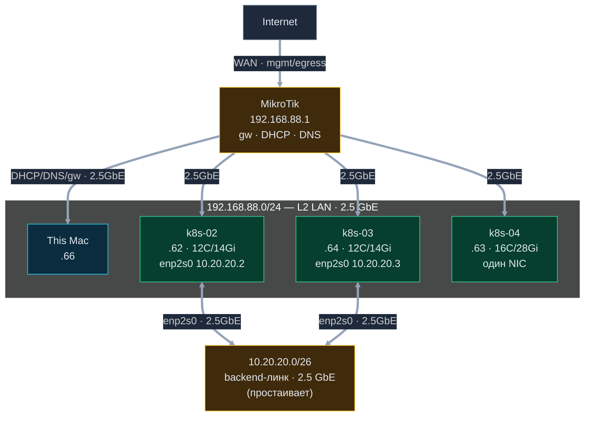

# Карта сети — demo-ai-lab

Аудит локального сегмента от `this Mac`. Шлюз — MikroTik. Ноды — **чистый Ubuntu 24.04**.
2 сегмента: **L2 LAN** (192.168.88.0/24, DHCP) и **backend** (10.20.20.0/26, прямой линк нод, 2.5Гбит/с).

## Узлы

| Хост | IP (eno1) | 2-й интерфейс | CPU | RAM | NVMe (полный) | состояние |
|---|---|---|---|---|---|---|
| `k8s-02` | 192.168.88.62 | enp2s0 10.20.20.2 · 2.5G up | 12C | 14Gi | 476.9G · root 266G | Ubuntu 24.04 |
| `k8s-03` | 192.168.88.64 | enp2s0 10.20.20.3 · 2.5G up | 12C | 14Gi | 476.9G · root 266G | Ubuntu 24.04 |
| `k8s-04` | 192.168.88.63 | — (enp3s0 down) | 16C | 28Gi | 476.9G · root 98G | Ubuntu 24.04 |
| `this Mac` | 192.168.88.66 | en0 | — | — | — | macOS 26.6 |

## Потоки / роли

- **L2 LAN (192.168.88/24, 2.5GbE)** — mgmt+данные: DHCP/DNS/шлюз от MikroTik; SSH-доступ с этого Mac.
- **Backend 10.20.20/26 (2.5GbE)** — прямой линк `k8s-02 ↔ k8s-03`; сейчас **простаивает**.
